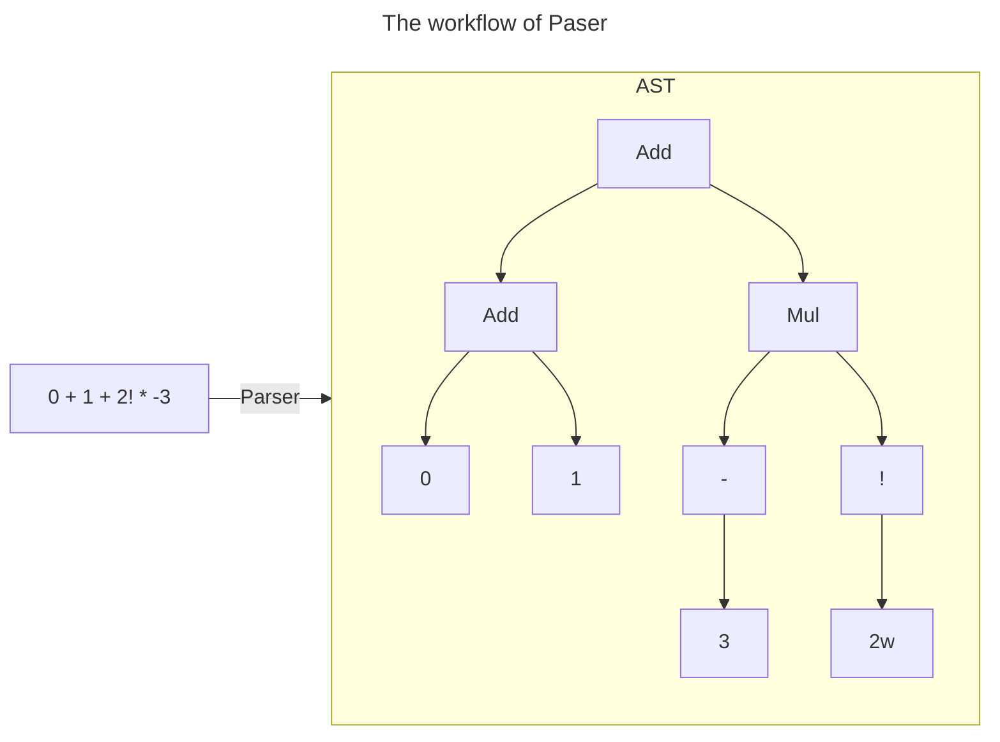
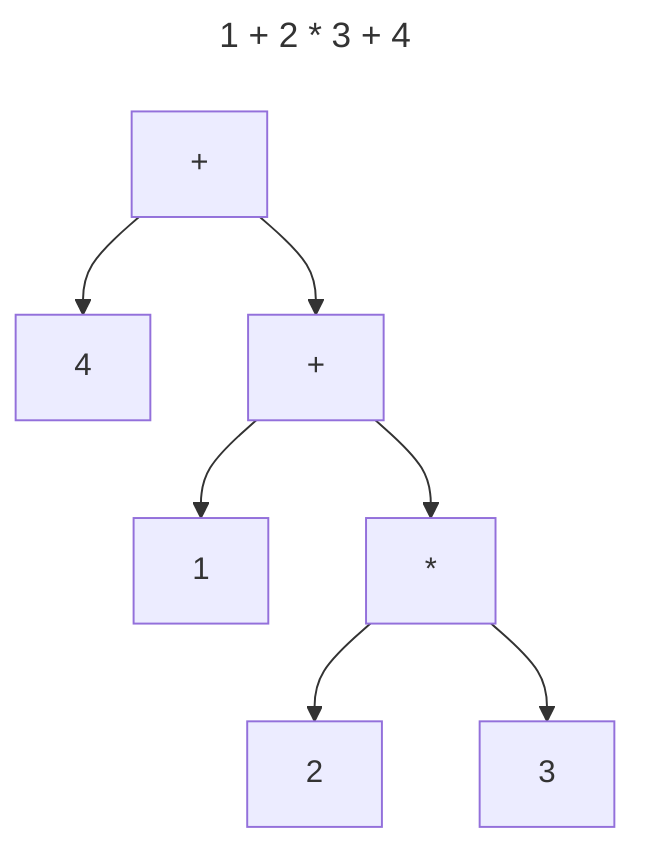
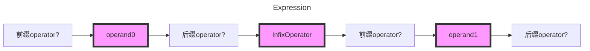
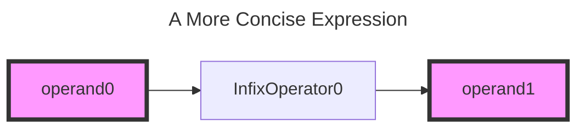
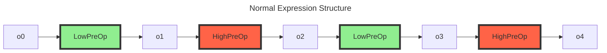
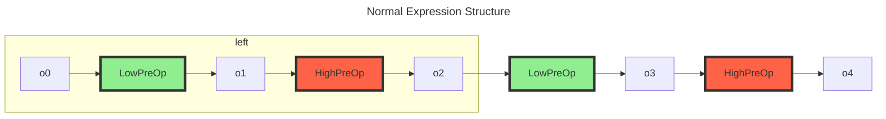
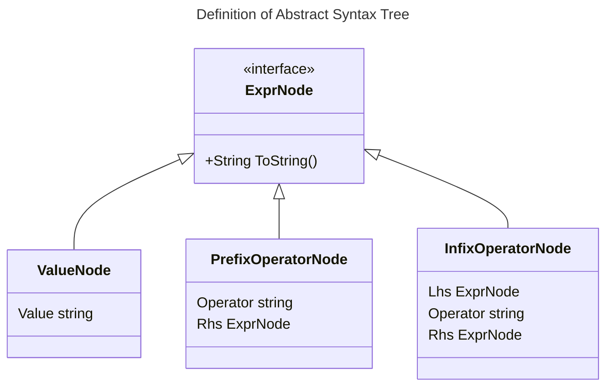
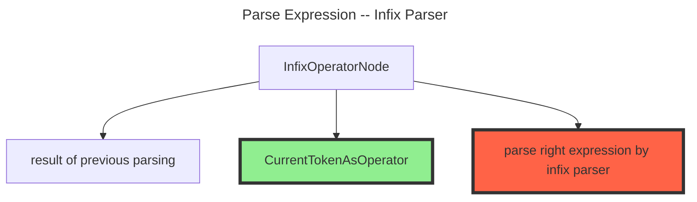
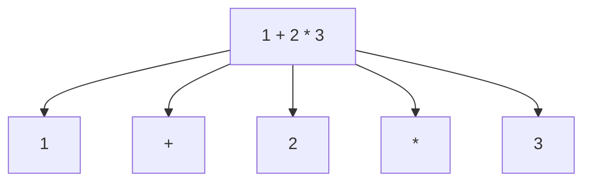

# readme

> 使用本文记录学习 `Pratt Parser` 的过程，全部代码实现基于 `go version go1.20.14 darwin/arm64` 实现，代码地址位于：[0x822a5b87/test-pratt-parsing](https://github.com/0x822a5b87/test-pratt-parsing)

## 什么是 Pratt Parser

在**语法解析器（Parser）**的工作过程中，我们通常会将一个字符串转换为一个**抽象语法树（Abstract Syntax Tree）**：



在这个解析过程中，我们会碰到许多问题：

1. 操作符的结合律（`associative`），例如 `0 + 1 + 2!` 的对应的语法树是 `(0 + 1) + 2` 还是 `0 + (1 + 2!)`？
2. 哪个运算应该先计算？`1 + 2!` 先出现，但是我们却应该先计算 `2! * -3`；
3. 前缀和后缀应该如何计算？`1 + 2!` 是 `1 + (2!)` 还是 `(1 + 2)!`

这些基本都是由于运算符（`Operator`）存在不同的优先级（`Precedence`），而 Pratt Parser就是为了解决这个运算符优先级而发明的一个算法，这个算法由 **Vaughan R. Pratt** 在论文 [Top Down Operator Precedence](https://tdop.github.io/) 中提出。

## BNF和hand-writeing the parser

在我们实现一个Parser的过程中，我们往往可以选择两个方式来生成我们的AST：

1. 使用一个DSL来声明语言的语法，通常是基于BNF/EBNF语法，比较常用的有 `antlr4`, `javacc` 等；
2. 手写解析器，通常是基于递归下降（Recursive descent）来实现；

### Recursive descent and left-recursion

如果我们现在通过BNF/EBNF语法声明一个sum运算，他的语法可能是这样的：

```js
sum = 
  sum '+' int 
  | int
```

等同于如下代码

```go
type Parser struct {
}

func (p *Parser) ParseSum() {
  // immediately recursive loop and overflow the stack 
	p.ParseSum()
	p.expected("+")
	p.ParseInt()
	
	// if that fails, try the second
}
```

也就是我们碰到了`左递归`（left-recursion），一个常用的方法是重写BNF`消除左递归`（eliminate the left recursion）

```js
sum = 
  int '+' sum
  | int
```

等同于

```go
type Parser struct {
}

func (p *Parser) ParseSum() {
	p.ParseInt()
  if p.expected("+") {
    p.nextToken()
  }
	p.ParseSum()
	
  // if that fails, try the second
}
```

## Pratt Parser 的基本原理

> Pratt Parser 的基本原理非常简单，**找到当前优先级最高的操作符，并按照操作符从高到低的方式创建AST。**

> 什么是优先级最高的节点？如何找到它？

从当前节点开始，通过 peek() 获取下一个operator，当下一个operator小于当前operator时，当前operator就是我们的最高优先级操作符。

例如，假设存在输入 `1 + 2 * 3 + 4`:

1. 到达operator `+`，peek() 得到operator `*`，我们继续往前找；
2. 到达 `*`，peek() 得到operator `+`，此时我们 `*` 就是我们要找到最高优先级操作符；

3. 我们通过 `parseMul()` 构造一个AST，root节点为 `*`，lhs 和 rhs 分别是 `2` 和 `3`；
4. 我们通过 `parseAdd()` 构造一个 AST，root节点为 `+`，lhs 和 rhs 分别是 `1` 和 `<3>` 得到的节点；
5. 继续向后，当到最后一个 `+` 时，peek() 得到 EOF，我们再次构造一个AST。

此时解析完毕，我们得到了如下AST（4的位置错误是由于mermaid的渲染BUG）：




> 在解析的过程中，我们向前peek()并跳到下一个token时，如何保存路径上的token节点信息呢？

我们可以通过递归，或者引入一个额外的栈来保存节点信息。为了保持我们的实现足够简洁，我们通过递归来实现。

## Pratt Parser 实现逻辑简述

参考文章 [Pratt Parsing and Precedence Climbing Are the Same Algorithm](https://www.oilshell.org/blog/2016/11/01.html)

> 1. You can assign each operator token a precedence, or binding power in Pratt's terminology.
> 2. You have a recursive function that parses expressions, consuming tokens to the right, until it reaches an operator of precedence less than or equal to the previous operator -- or just less than if it's a right-associative operator.
> 3. In Pratt parsing, tokens can be used in the null and/or left position, based on whether they take an expression on the left or not (nud or led in Pratt's terminology). Examples of left operators are infix +, postfix ++, or the pseudo-infix a[0] (with operator [). Examples of null operators are unary minus -, and grouping parentheses (.

1. 首先，为expression中的所有 `operator token` 分配一个优先级（precedence），或者绑定强度（binding power）；
2. 将 token 分为三类，分别是 `前缀运算符` 和 `中缀运算符`。
   1. 前缀运算符，比如负数；
   2. 中缀运算符，比如加减乘除；
   3. 后缀运算符，可以当做一个特殊的中缀运算符，例如阶乘。通过这种方式我们可以极大的简化我们的算法。
3. 会每个token关联一个解析函数：
   1. `prefixParseFns map[token.TokenType]prefixParseFn` 解析token类型对应的前缀表达式；
   2. `infixParseFns  map[token.TokenType]infixParseFn` 解析token类型对应的中缀表达式，而后缀表达式可以认为是一种特殊的中缀表达式。
4. 进入解析逻辑，根据当前的tokenType获取对应的解析函数。此时，我们碰到的必然是一个**前缀表达式** 。这是为什么？原因如下：
   1. 当我们进入到解析逻辑时，第一个token解析过程如下：
      1. 一个前缀表达式的operator，例如 `-x` 中的 `-`，对于这种情况，我们直接将该operator作为 PrefixExpression 的 operator，随后跳过该 operator，并将右边的解析结果作为PrefixExpression的`rhs`。**并且把operator和rhs作为一个PrefixExpression返回**。
      2. 一个可以解析的对象，可能是bool，integer，identifier 等，此时我们直接将对应类型的解析对应的Expression返回；
      3. 前缀表达式opertor的优先级非常高，仅仅有 `(` 对应的优先级高于前缀表达式opertor，而我们可以把 `(` 当成一个特殊的中缀操作符处理；
   2. 经过<1>，我们会得到一个Expression，此时我们再往前执行，必然是一个 `InfixExpressionOperator`；
5. 开始遍历整个表达式：
   1. 如果 `currPrecedence` < `peekPrecedence`，说明后续还有优先级更高的operator，我们将当前解析到的数据压入栈中（一般是通过递归）；
   2. 如果 `currPrecedence` >= `peekPrecedence`，阶段性解析结束，因为此时我们已经找到了优先级最高的operator。我们将 `<1>` 中栈弹出，并按照对应的token逻辑来进行解析。


整体来说，我们通过 `PrefixParser` 和 `InfixParser` 将一个表达式，从如下形式：



转换为一个更简洁的形式并通过先查找局部最高优先级并解析的方式解析。：



例如，我们的整体表达式肯定是一个如下的结构：




他们可以被分块解析，左边解析得到的AST，就是右边的InfixOperator的 lhs。




## Pratt Parser 的实现

### 文法定义

首先，我们定义的是一个支持以下特性的表达式：

1. 负数 `-10`（前缀表达式）；
1. 加减乘除四则运算（中缀表达式）；
1. 阶乘 `10!`（后缀表达式）；
1. 仅支持整数；

> 对应的antrl4定义如下：这里值得注意的一点是，我们这里的语法看起来像是存在一个左递归，但是实际这个语法却可以编译运行，这是因为 `antlr4` 通过一些方式来支持了 **直接左递归（direct left-recursion）**。

```js
grammar Expression;

// 解析入口
expr:   expr op=('*'|'/') expr   # MulDivExpr
    |   expr op=('+'|'-') expr   # AddSubExpr
    |   '-' expr                 # NegateExpr
    |   expr '!'                 # FactorialExpr
    |   INT                      # IntExpr
    |   '(' expr ')'             # ParenExpr
    ;

// 词法规则
INT:    [0-9]+ ;
WS:     [ \t\r\n]+ -> skip ;
```

### 定义token

> token 的解析我们直接使用了这个库 [bzick/tokenizer](https://github.com/bzick/tokenizer)，我们也可以使用数组的方式来mock实际的token解析，但是这样不够灵活，加上tokenizer的库使用也很简单，我们最终决定直接使用tokenizer库为我们提供token解析能力。

```go
package token

import (
	"github.com/bzick/tokenizer"
)

const (
	_ = iota
	TypePlus
	TypeMinus
	TypeAsterisk
	TypeSlash
	TypeExclamation
	TypeCaret
	TypeLPa
	TypeRPa
	TypeSemicolon
)

func NewTokenizer() *tokenizer.Tokenizer {
	// configure tokenizer
	tokenizers := tokenizer.New()
	tokenizers.DefineTokens(TypePlus, []string{"+"})
	tokenizers.DefineTokens(TypeMinus, []string{"-"})
	tokenizers.DefineTokens(TypeAsterisk, []string{"*"})
	tokenizers.DefineTokens(TypeSlash, []string{"/"})
	tokenizers.DefineTokens(TypeExclamation, []string{"!"})
	tokenizers.DefineTokens(TypeCaret, []string{"^"})
	tokenizers.DefineTokens(TypeLPa, []string{"("})
	tokenizers.DefineTokens(TypeRPa, []string{")"})
	tokenizers.DefineTokens(TypeSemicolon, []string{";"})
	return tokenizers
}
```

### AST

为了构建我们的语法树，我们还需要一些AST结构体：




```go
type ExprNode interface {
	ToString() string
}

type ValueNode struct {
	Value int64
}

func (v *ValueNode) ToString() string {
	return strconv.FormatInt(v.Value, 10)
}

type PrefixOperatorNode struct {
	Operator string
	Rhs      ExprNode
}

func (p *PrefixOperatorNode) ToString() string {
	return fmt.Sprintf("%s%s", p.Operator, p.Rhs.ToString())
}

type InfixOperatorNode struct {
	Lhs      ExprNode
	Operator string
	Rhs      ExprNode
}

func (i *InfixOperatorNode) ToString() string {
	// we treat suffix expression as infix expression, so we must handle a nullable situation
	if i.Rhs != nil {
		return fmt.Sprintf("(%s %s %s)", i.Lhs.ToString(), i.Operator, i.Rhs.ToString())
	} else {
		return fmt.Sprintf("(%s%s)", i.Lhs.ToString(), i.Operator)
	}
}
```

### parser

#### 分配precedence

我们为所有的token单独的分配一个优先级，这个优先级将会决定我们递归解析的退出条件

```go
type Precedence int

const (
	Number  Precedence = 10 // Number integer,number,identifier...
	Sum     Precedence = 20 // +
	Product Precedence = 30 // *
	Prefix  Precedence = 40 // -X or !X
)

var precedences = map[tokenizer.TokenKey]Precedence{
	tokenizer.TokenInteger: Number,
	token.TypePlus:         Sum,
	token.TypeAsterisk:     Product,
	token.TypeExclamation:  Prefix,
}

```

#### 定义解析函数

为每个token都绑定对应的解析函数

```go
// prefixParseFn parse prefix operator
type prefixParseFn func() ast.ExprNode

// infixParseFn parse infix operator
type infixParseFn func(lhs ast.ExprNode) ast.ExprNode

type Parser struct {
	stream         *tokenizer.Stream
	prefixParseFns map[tokenizer.TokenKey]prefixParseFn
	infixParseFns  map[tokenizer.TokenKey]infixParseFn
}

func NewParser(input string) *Parser {
	tk := token.NewTokenizer()
	p := Parser{
		stream:         tk.ParseString(input),
		prefixParseFns: make(map[tokenizer.TokenKey]prefixParseFn),
		infixParseFns:  make(map[tokenizer.TokenKey]infixParseFn),
	}

	p.registerPrefixParseFn(tokenizer.TokenInteger, p.parseInteger)
	p.registerPrefixParseFn(token.TypeMinus, p.parsePrefixOperator)

	p.registerInfixParseFn(token.TypePlus, p.parseInfixOperator)
	p.registerInfixParseFn(token.TypeAsterisk, p.parseInfixOperator)
	p.registerInfixParseFn(token.TypeExclamation, p.parseSuffixOperator)

	return &p
}

func (p *Parser) registerPrefixParseFn(tokenType tokenizer.TokenKey, fn prefixParseFn) {
	p.prefixParseFns[tokenType] = fn
}

func (p *Parser) registerInfixParseFn(tokenType tokenizer.TokenKey, fn infixParseFn) {
	p.infixParseFns[tokenType] = fn
}
```

#### 真正的解析流程

`ParseExpression` 是解析程序的入口，在 ParseExpression 中：

1. 我们先解析当前token；
2. 比较当前precedence和下一个token的precedence，并根据条件进行选择策略；

> 如果我们没有达到stream的结束为止，并且 peekPrecedence > currentPrecedence，

则先解析 peekToken。由于 peekToken 一定是一个中缀表达式（后缀表达式我们可以把它当成一个rhs为nil的中缀表达式），此时得到的节点应该是这样：



中缀节点的三个节点分别是：

1. 左边表达式的parse结果；
2. 当前token转换为的operator；
3. 右侧表达式递归的解析 `p.ParseExpression(precedence)`，注意，这里我们修改了当前优先级；

> 如果stream流结束，或者 peekPrecedence <= currentPrecedence，我们已经找到了当前能找到的最高precedence节点。

```go
func (p *Parser) ParseExpression(precedence Precedence) ast.ExprNode {
	prefixFn := p.getPrefixParseFn(p.currentTokenType())
	// the left-hand side
	lhs := prefixFn()
	// if we don't reach the end of stream and the precedence of the peek token is greater than the current token
	// then we must parse peek token first, and the parsing result of the current token
	// should be lhs of the peek token
	for p.currentTokenIsValid() && precedence < p.peekPrecedence() {
		infixFn := p.getInfixParseFn(p.currentTokenType())
		lhs = infixFn(lhs)
	}
	return lhs
}

func (p *Parser) parsePrefixOperator() ast.ExprNode {
	node := ast.PrefixOperatorNode{
		Operator: p.currentTokenStringValue(),
	}
	p.goNext()
	node.Rhs = p.ParseExpression(Prefix)
	return &node
}

// the previous parsing result will the lhs of current token
func (p *Parser) parseInfixOperator(lhs ast.ExprNode) ast.ExprNode {
	node := ast.InfixOperatorNode{
		Lhs:      lhs,
		Operator: p.stream.CurrentToken().ValueString(),
	}

	precedence := precedences[p.currentTokenType()]
	p.goNext()
 
  // handle suffix operator for 
	if p.currentTokenIsValid() {
		node.Rhs = p.ParseExpression(precedence)
	}
	return &node
}

// parseSuffixOperator handle suffix operator
// the main difference between infix operators and suffix operators is that
// infix operators is followed by number/bool/identifier, whereas suffix operators is followed by an infix operator
func (p *Parser) parseSuffixOperator(lhs ast.ExprNode) ast.ExprNode {
	node := ast.InfixOperatorNode{
		Lhs:      lhs,
		Operator: p.stream.CurrentToken().ValueString(),
	}

	p.goNext()

	if p.currentTokenIsValid() {
		infixFn := p.getInfixParseFn(p.currentTokenType())
		return infixFn(&node)
	} else {
		return &node
	}
}
```

## 解析流程详解

> 该章节暂未完成，等待补充

假设存在如下的表达式：




整体执行过程可以用如下图表表示：

| id   | 当前运算符 | 当前优先级 | 剩余运算符 | 描述                                       | 局部AST栈 |
| ---- | ---------- | ---------- | ---------- | ------------------------------------------ | --------- |
| 0    |            | 0          | 1 + 2 * 3  | 由最低优先级开始解析                       |           |
| 1    | 1          | 1          | + 2 * 3    | 解析得到第一个节点 1                       | 1         |
| 2    | +          | 2          | 2 * 3      | + 运算符优先级高于数字，执行加号的关联函数 | 2         |

## references

- [What exactly is Pratt parsing used for and how does it work?](https://langdev.stackexchange.com/questions/3254/what-exactly-is-pratt-parsing-used-for-and-how-does-it-work)
- [Simple but Powerful Pratt Parsing](https://matklad.github.io/2020/04/13/simple-but-powerful-pratt-parsing.html)
- [Pratt Parsing Index and Updates](https://www.oilshell.org/blog/2017/03/31.html)
- [Pratt Parsing 算法介绍及实现](https://www.less-bug.com/posts/pratt-parsing-introduction-and-implementation-in-typescript/)

- [Pratt Parsing and Precedence Climbing Are the Same Algorithm](https://www.oilshell.org/blog/2016/11/01.html)